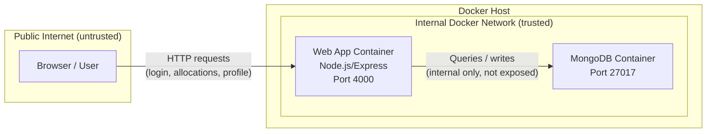

# Threat Model — NodeGoat DevSecOps Project

## 1. System Overview
The system runs as a Web App Container (Node.js/Express) and a MongoDB Container, both inside a Docker host on an internal, trusted network. The only boundary exposed to the public internet is the Web App Container on port 4000 — this is where all user input (login, allocations, profile data) enters the system and is the primary attack surface. MongoDB is never exposed directly; it's only reachable from the Web App Container over the internal Docker network, so any threat reaching the database has to pass through the app layer first.

## 2. STRIDE Analysis

| Threat ID | Description | STRIDE Category | Component/Data Flow |
|-----------|--------------|------------------|----------------------|
| T1 | Login and search fields pass raw user input into MongoDB queries, so an attacker can manipulate the query itself instead of just the data (classic NoSQL injection in this app) | Tampering | Browser → Express → MongoDB |
| T2 | The Memos feature lets users store free text that gets shown to others later without being cleaned up first — a script planted there runs in whoever views it | Tampering / Info Disclosure | Browser → Express → MongoDB → Browser |
| T3 | Because state-changing requests don't check where they came from, a victim could be tricked into submitting a request just by visiting a malicious page while logged in | Spoofing | Browser → Express (profile/account endpoints) |
| T4 | Some config values and keys are sitting directly in the source rather than being pulled from environment variables, so anyone who gets repo access gets the credentials too | Info Disclosure | Source code / config files |

## 3. Risk Assessment

| Threat ID | Likelihood | Impact | Score | Justification |
|-----------|------------|--------|-------|----------------|
| T1 | 3 | 3 | 9 | This is one of the most commonly demonstrated NodeGoat flaws, so it's easy to trigger, and it can lead straight to bypassing login |
| T2 | 2 | 2 | 4 | Needs a bit of setup (attacker posts the payload, someone else has to open it), so it's a step slower to pull off, but it can still leak session data |
| T3 | 2 | 2 | 4 | Depends on getting a logged-in user to click something external, so it's not trivial, but the app currently gives no protection against it either |
| T4 | 2 | 3 | 6 | Not something an outside attacker can trigger directly, but if the repo or a screenshot leaks, the damage is immediate and hard to undo |

## 4. Threat-to-Control Mapping

| Threat ID | Mitigating Control | Where It Lives |
|-----------|----------------------|-------------------|
| T1 | Semgrep rules catching unsanitized query construction, plus basic input validation in the route handlers | sast-semgrep gate |
| T2 | Output should be escaped before being rendered back to users; semgrep can also catch obvious unescaped-output patterns | sast-semgrep gate |
| T3 | Adding CSRF middleware and checking for it as part of dependency review | dependency-audit gate |
| T4 | Gitleaks blocks any commit that contains something that looks like a key or credential | secrets-scan gate, config in .gitleaks.toml |

## 5. Industry Trends & Case Study Analysis

One real-world incident that closely relates to this project's DevSecOps practices is the **Log4Shell vulnerability** (CVE-2021-44228), discovered in December 2021. Log4Shell was a critical remote code execution flaw in Log4j, a widely-used Java logging library. Attackers could trigger arbitrary code execution simply by getting a vulnerable application to log a specially crafted string, since Log4j would automatically resolve embedded JNDI lookups. Because Log4j was buried deep inside thousands of applications as a transitive dependency, most organizations didn't even know they were exposed until the vulnerability was public — by then, attackers were already scanning the internet for vulnerable systems.

**Why this is relevant to our project:** Log4Shell exists because a dangerous, exploitable pattern sat undetected in production code and its dependencies for years. This is exactly the class of risk our pipeline is designed to catch early rather than after deployment:

- Our **`dependency-audit`** gate checks for known-vulnerable packages before code reaches production — the same category of check that would have flagged a vulnerable Log4j version had it been part of a Node.js dependency tree equivalent.
- Our **`sast-semgrep`** gate performs static analysis to catch dangerous code patterns (like our own `eval()` injection and MongoDB `$where` injection issues) before they ship — Log4shell is a reminder that a single unchecked input-handling pattern in a widely-used component can have massive downstream impact.
- Our **`secrets-scan`** gate (via `.gitleaks.toml`) reduces a different but related risk: even after a vulnerability like Log4Shell is patched, exposed credentials or config could let an attacker exploit the window of compromise further.

The broader industry lesson from Log4Shell is that **shifting security left** — catching issues at the code and dependency level, before deployment — is far cheaper and safer than patching after mass exploitation has already begun. That's the same principle behind every gate in this project's pipeline: `build-and-test`, `sast-semgrep`, `dependency-audit`, `secrets-scan`, and `container-scan` all exist to catch a Log4Shell-style issue during development rather than after attackers find it first.