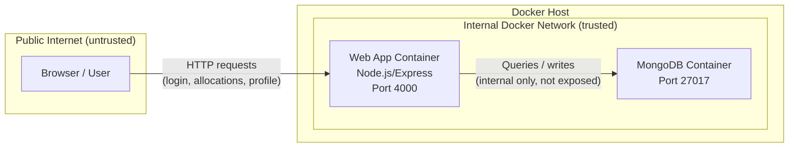

# Architecture Diagram — NodeGoat DevSecOps Pipeline

## Components
- **Web App (Node.js / Express)** — handles routing, authentication, sessions, and business logic (allocations, profile, contributions)
- **MongoDB** — stores user accounts, sessions, and financial allocation data

## Data Flow

## Trust Boundaries
1. **Public Internet ↔ Web App** — the only boundary exposed externally, on port 4000. All user input crosses here (login forms, allocation inputs) — this is the primary attack surface.
2. **Web App ↔ MongoDB** — internal Docker network only. MongoDB is never exposed to the host network directly; only the web container can reach it.

## Tech Stack
- Node.js / Express (web app)
- MongoDB (database)
- Docker & Docker Compose (containerisation)